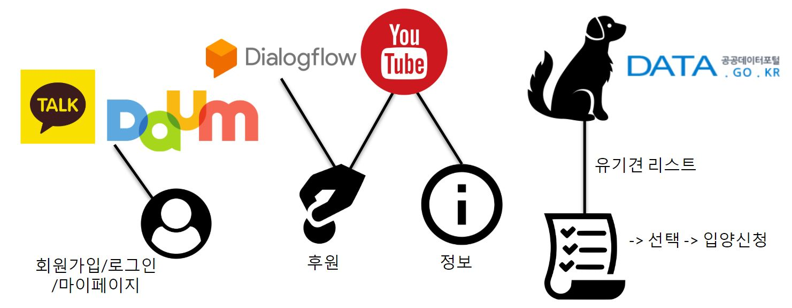
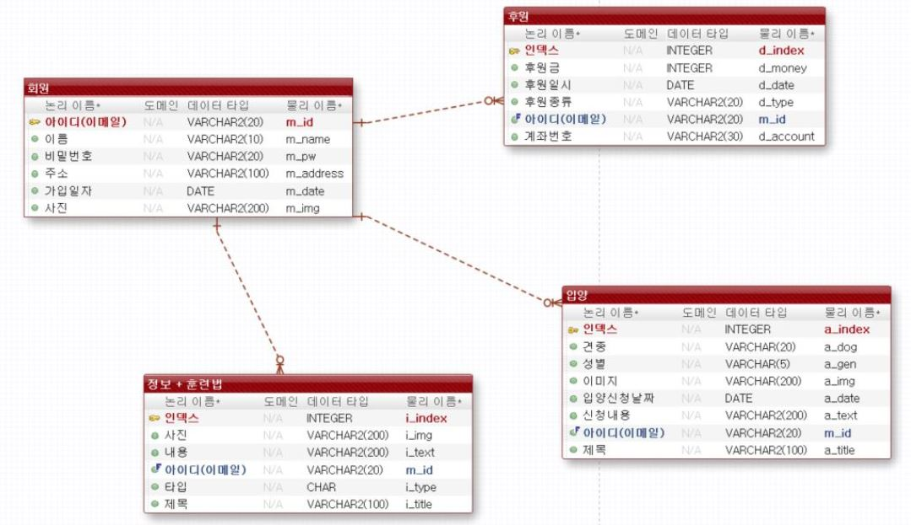
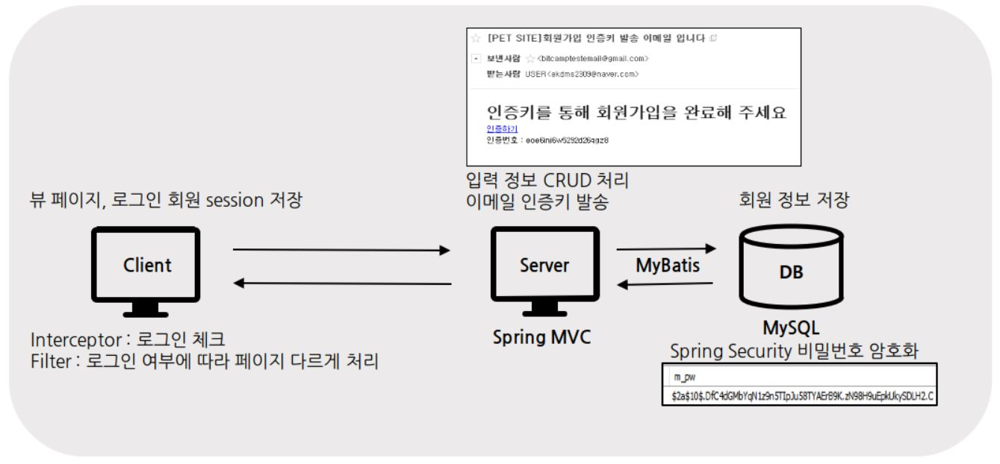

# 1. 소개

Model 2 - Spring MVC 구조로 구현한 웹 사이트 입니다.

---

팀 프로젝트 (구성원: 4명)

개발기간: 1개월

배포여부: YES (현재 중단)

---

- 흐름

- DB

## 2. 내가 구현한 주요 기능

로그인 / 회원가입 / 마이페이지

로그아웃 / 회원탈퇴

이메일 인증키 발송

Kakao API / Daum 우편 서비스 API

Spring Security로 사용자 비밀번호 암호화 처리

Interceptor로 Login Check / Filter로 분기처리

이미지 파일 업로드 및 수정

## 3. 적용기술

-	**웹 화면 구성** : HTML5, CSS3, JavaScript, bootstrap4

-	**검색 결과 데이터 요청 및 출력** : jQuery, Ajax, JSON

-	**결과를 얻어오기 위한 서버 액션** : JAVA, JSP, EL, jQuery

-	**DB 액션 처리** : MyBatis

-	**DBMS** : MySQL

-	**AWS 배포** : EC2, RDS

-	**로그인 Api** : KakaoTalk API, Daum 우편 서비스 API

-	**프레임워크** : Spring MVC

## 4. 구현내용 및 배운 점

**로그인 체크 → Filter / Interceptor**

Filter와 Interceptor를 활용하여 로그인 체크를 하고 로그인 여부에 따라 페이지를 이동시키는 방법을 배웠습니다.

**간편 로그인 → Kakao API**

처음으로 API를 통해 간편 로그인 기능을 구현해보며 로그인 방식에 따라 마이페이지의 내용을 다르게 출력했습니다.

**이미지 수정 → POST Mapping**

파일과 일반 Form의 <input> 내용을 한번에 수정 처리를 하려고 하는 중 에러사항을 겪으면서

FormData를 활용한 파일 수정은 일반 Form의 내용 수정과 달리 POST Mapping만 적용이 가능하다는 것을 배웠습니다.

## 5. 프로젝트 설명PPT

[https://docs.google.com/presentation/d/13SQ7o2jX8VPoic8wkdYXqWLXxqBZmF3uYvHZzzZXO_k/edit](https://docs.google.com/presentation/d/13SQ7o2jX8VPoic8wkdYXqWLXxqBZmF3uYvHZzzZXO_k/edit)
